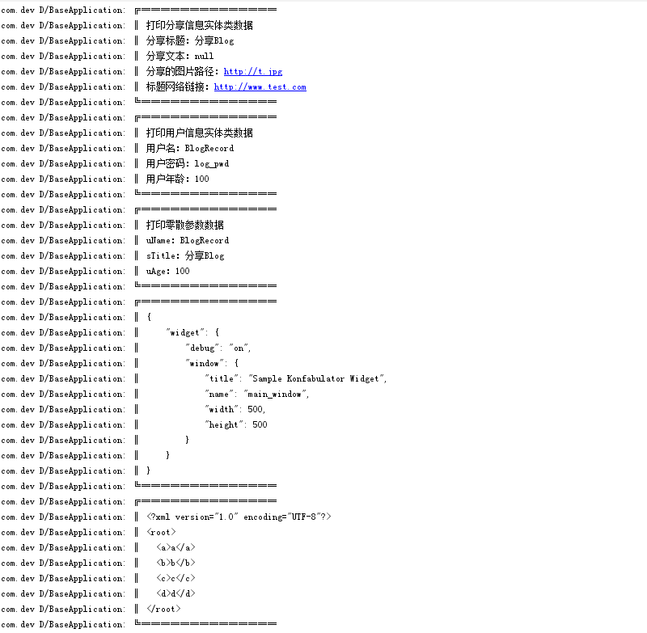
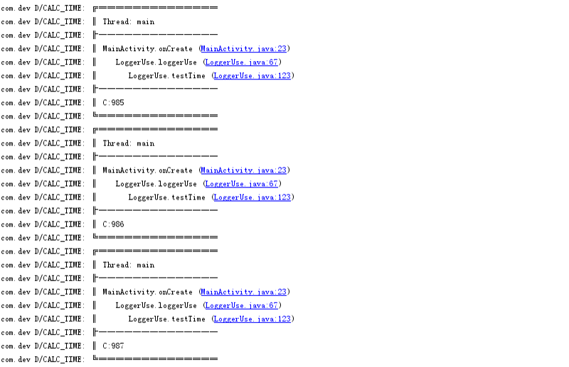
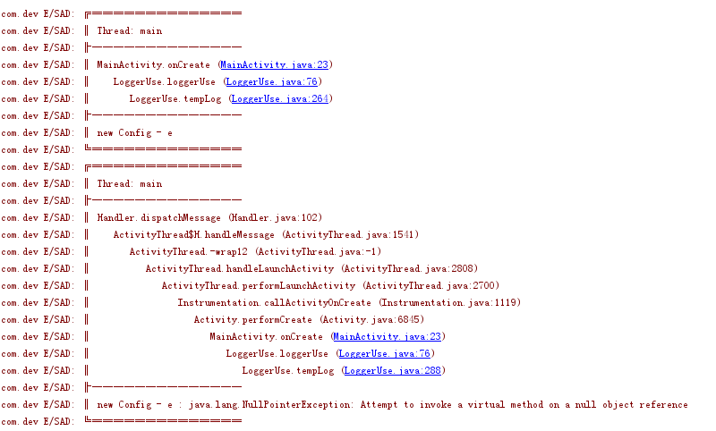
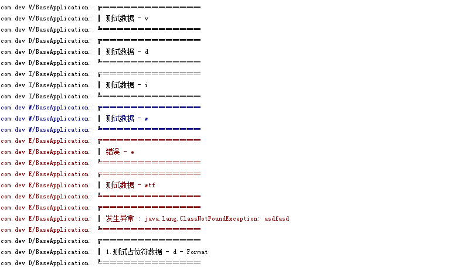
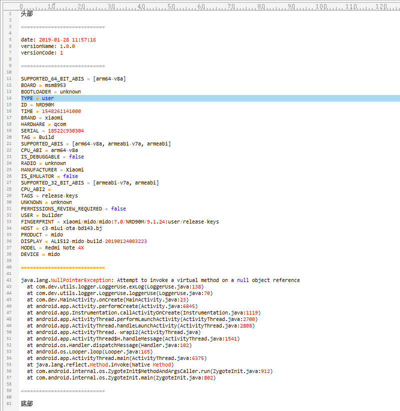

# DevLogger 日志工具类

#### [项目类结构](https://github.com/afkT/DevUtils/tree/master/DevLibUtils/src/main/java/dev/utils/app/logger)

日志操作类（[DevLogger](https://github.com/afkT/DevUtils/blob/master/DevLibUtils/src/main/java/dev/utils/app/logger/DevLogger.java)）：日志操作类(对外公开直接调用)，直接调用日志输入类方法。


日志操作工具类（DevLoggerUtils）：提供常用日志配置快捷获取方法、以及日志存储方法等


日志接口（IPrinter）：主要编写可以被外部调用接口，以及可以操作的类型。


日志输出类（LoggerPrinter）：实现日志接口，并且对对应的方法，进行处理，最终打印。


日志设置（LogConfig）：该类主要控制日志输出方式，以及是否输入日志，堆栈方法等。


日志配置（LogConstants）：该类主要是常量配置信息。


日志级别（LogLevel）：该类主要控制日志级别。


日志内部工具类（Utils）：内部快捷操作工具类(获取应用信息、设备信息、存储文件等)

#### 框架亮点

* 支持全局日志统一配置, 以及部分日志个性化配置

* 支持无限长度日志打印, 无 Logcat 4000 字符限制

* 支持可变参数传参，任意个数打印参数

* 支持 JSON、XML 字符串解析、格式化打印

* 支持无 Tag 快捷打印、以及全局配置 Tag

* 支持显示行号、线程、类、方法信息等打印, 以及堆栈信息跟踪、偏移打印等

* 支持全局控制打印级别, 防止信息泄露, 以及控制是否打印日志

* 支持存储日志信息到文件中(含手机设备信息、应用版本信息), 并且可追加顶部、底部信息等

* 美化日志, 与系统日志打印格式区分, 清晰快捷找到关键日志


#### 全局配置

```java
// == 在BaseApplication 中调用 ==
// 初始化日志配置
LogConfig lConfig = new LogConfig();
// 堆栈方法总数(显示经过的方法)
lConfig.methodCount = 3;
// 堆栈方法索引偏移(0 = 最新经过调用的方法信息,偏移则往上推,如 1 = 倒数第二条经过调用的方法信息)
lConfig.methodOffset = 0;
// 是否输出全部方法(在特殊情况下，如想要打印全部经过的方法，但是不知道经过的总数)
lConfig.isOutputMethodAll = false;
// 显示日志线程信息(特殊情况，显示经过的线程信息,具体情况如上)
lConfig.isDisplayThreadInfo = false;
// 是否排序日志(格式化后)
lConfig.isSortLog = false; // 是否美化日志, 边框包围
// 日志级别
lConfig.logLevel = LogLevel.DEBUG;
// 设置Tag(特殊情况使用，不使用全部的Tag时,如单独输出在某个Tag下)
lConfig.tag = "BaseLog";
// 进行初始化配置 => 这样设置后, 默认全部日志都使用改配置, 特殊使用 DevLogger.other(config).d(xxx);
DevLogger.init(lConfig);
// 进行初始化配置 => 在DevUtils.init() 内部调用了
// DevLoggerUtils.init(mContext); // 日志操作工具类, 快捷获取 LogConfig、以及保存日志到文件中等
```


#### 配置事项
```java
// 发布的时候, 默认不需要打印日志则修改为
LogConfig lConfig = new LogConfig();
lConfig.logLevel = LogLevel.NONE; // 全部不打印
DevLogger.init(lConfig); // 该方法设置全局默认日志配置

// 还有一种情况，部分日志发布的时候不打印，但是有部分异常信息需要打印, 则单独使用配置
DevLoggerUtils.getReleaseLogConfig(TAG) => 使用封装好的线上配置都行
DevLoggerUtils.getReleaseLogConfig(TAG, LogLevel) => 使用封装好的线上配置都行
DevLogger.init(DevLoggerUtils.getReleaseLogConfig(TAG));

// DevLoggerUtils 内部包含 常用日志配置快捷获取方法、以及日志存储方法等
```


#### 打印日志
```java
// 无 Tag 快捷打印 (使用全局 LogConfig.tag)
DevLogger.v("测试数据 - v");
DevLogger.d("测试数据 - d");
DevLogger.i("测试数据 - i");
DevLogger.w("测试数据 - w");
DevLogger.e("异常 - e");
DevLogger.wtf("测试数据 - wtf");

// 使用 自定义 Tag 打印日志
DevLogger.vTag(tag, "测试数据 - v");
DevLogger.dTag(tag, "测试数据 - d");
DevLogger.iTag(tag, "测试数据 - i");
DevLogger.wTag(tag, "测试数据 - w");
DevLogger.eTag(tag, "异常 - e");
DevLogger.wtfTag(tag, "测试数据 - wtf");

// 占位符(其他类型，一样)
DevLogger.d("%s测试占位符数据 - d%s", new Object[]{"1.", " - Format"});
// --
DevLogger.dTag(tag, "%s测试占位符数据 - d%s", new Object[]{"1.", " - Format"});

// 打印 JSON、XML 格式字符串数据
// JSON对象
DevLogger.json(TestData.SMALL_SON_WITH_NO_LINE_BREAK);
DevLogger.jsonTag(tag, TestData.SMALL_SON_WITH_NO_LINE_BREAK);
// XML数据
DevLogger.xml(TestData.XML_DATA);
DevLogger.xmlTag(tag, TestData.XML_DATA);
```


#### 打印日志(自定义配置)
```java
// 初始化日志配置
LogConfig lConfig = new LogConfig();
// 是否排序日志(格式化后)
lConfig.isSortLog = true;
// 日志级别
lConfig.logLevel = LogLevel.DEBUG;
// 设置Tag(特殊情况使用，不使用全部的Tag时,如单独输出在某个Tag下)
lConfig.tag = "SAD";
// 打印日志信息
DevLogger.other(lConfig).e("new Config - e");
DevLogger.other(lConfig).e(new Exception("报错"), "new Config - e");
DevLogger.other(lConfig).eTag(tag, "new Config - e");
DevLogger.other(lConfig).eTag(tag, new Exception("报错"), "new Config - e");

// 有 Tag 优先使用自定义 Tag, 无 Tag 才使用 LogConfig.tag 
DevLogger.other(lConfig).eTag(tag, "new Config - e");
```


#### 存储日志文件
```java
// ================
// 存储异常日志信息
// ================

try {
    String s = null;
    s.indexOf("c");
} catch (NullPointerException e) {
    // 打印格式化后的日志信息
    DevLogger.other(DevLoggerUtils.getSortLogConfig("LogPro")).e(e, "s = null");
    // 保存的路径
    String fName = LOG_SD_PATH + System.currentTimeMillis() + ".log";
    // 保存日志信息
    DevLoggerUtils.saveErrorLog(e, fName, true);
    // --
    // 保存自定义头部、底部信息
    DevLoggerUtils.saveErrorLog(e, "头部", "底部", LOG_SD_PATH, System.currentTimeMillis() + "_存在头部_底部.log", true);
    // --
    // 自定义(无设备信息、失败信息获取失败) - 正常不会出现，所以其实这个可以不用
    String[] eHint = new String[]{"DeviceInfo = 获取设备信息失败", "获取失败"};
    // 保存的路径
    fName = LOG_SD_PATH + System.currentTimeMillis() + "_orgs.log";
    // 保存日志信息
    DevLoggerUtils.saveErrorLog(e, fName, true, eHint);
}

// ============
// 存储日志信息
// ============

// 保存文件名
String fName = System.currentTimeMillis() + ".log";
// 自定义(无设备信息、失败信息获取失败) - 正常不会出现，所以其实这个可以不用
String[] eHint = new String[]{"DeviceInfo = 获取设备信息失败", "获取失败"};
// 保存日志
DevLoggerUtils.saveLog("保存自定义信息日志", LOG_SD_PATH, fName, eHint);

// === 保存日志, 包含头部信息、底部信息 ===
// 保存文件名
fName = System.currentTimeMillis() + ".log";
// 保存日志
DevLoggerUtils.saveLog("保存自定义信息日志", "头部", "底部", LOG_SD_PATH, fName, eHint);
```


# 预览

***XML、JSON 格式化打印***



***打印堆栈信息***



***打印异常信息***



***正常打印***



***保存日志文件***

